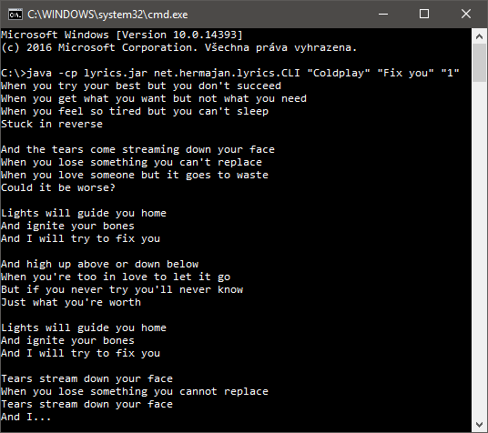
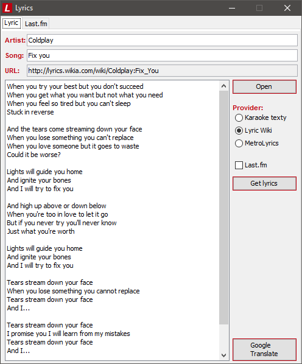

# Lyrics
Lyrics is an application for showing music lyrics from the internet.

It uses library [jsoup](https://github.com/jhy/jsoup) for parsing data.

## Download
Latest version of runnable file `lyrics.jar` you can download [here](https://github.com/hermajan/lyrics/releases/latest).

## Usage
First you need to have installed [Java](https://www.java.com/en/download/faq/whatis_java.xml) on your computer. Then you can choose between command-line interface or graphical user interface.

### Command-line interface
Run the application with following command: 

`java -cp lyrics.jar net.hermajan.lyrics.CLI`

Use Lyrics with number of command-line arguments:
* 0: Application obtains an artist and a song from your Last.fm account set in `lyrics.properties` file.
* 1: Argument `help` or `?` shows help. Argument `"provider"` obtains an artist and a song from your Last.fm account set in `lyrics.properties` file and shows music lyrics from selected provider.
* 2: Arguments in format `"artist" "song"` shows music lyrics.
* 3: Arguments in format `"artist" "song" "provider"` shows music lyrics from selected provider.

Providers are `0` for KaraokeTexty, `1` for LyricWiki, `2` for MetroLyrics.

For example, command `java -cp lyrics.jar net.hermajan.lyrics.CLI "Coldplay" "Fix you" 1` starts Lyrics and it shows you this:

### Graphical user interface
Run the file `lyrics.jar` or use command-line arguments as above, but with command like this:

`lyrics.jar "artist" "song"`

For example, command `lyrics.jar "Coldplay" "Fix you"` starts Lyrics and it shows you this:

