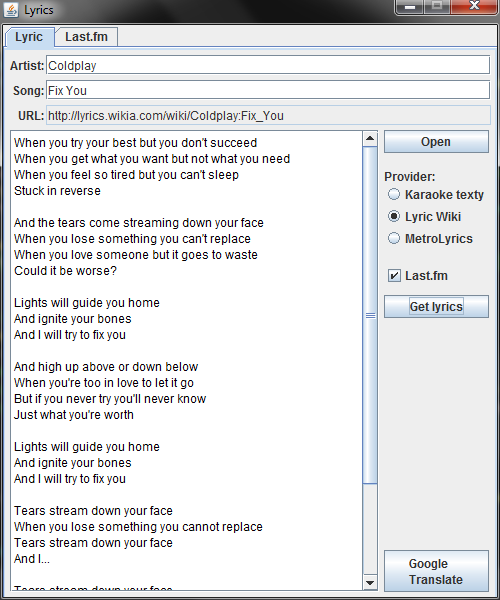

# Lyrics
Lyrics is an application for showing music lyrics from the internet.

It uses library [jsoup](https://github.com/jhy/jsoup) for parsing data.

## Download
Latest version you can download [here](https://github.com/hermajan/lyrics/releases/latest).

## Usage
Run the file `lyrics.jar` or use command-line arguments:

`lyrics.jar "artist" "song"`

For example, command `lyrics.jar "Coldplay" "Fix you"` starts Lyrics and it shows you this:

